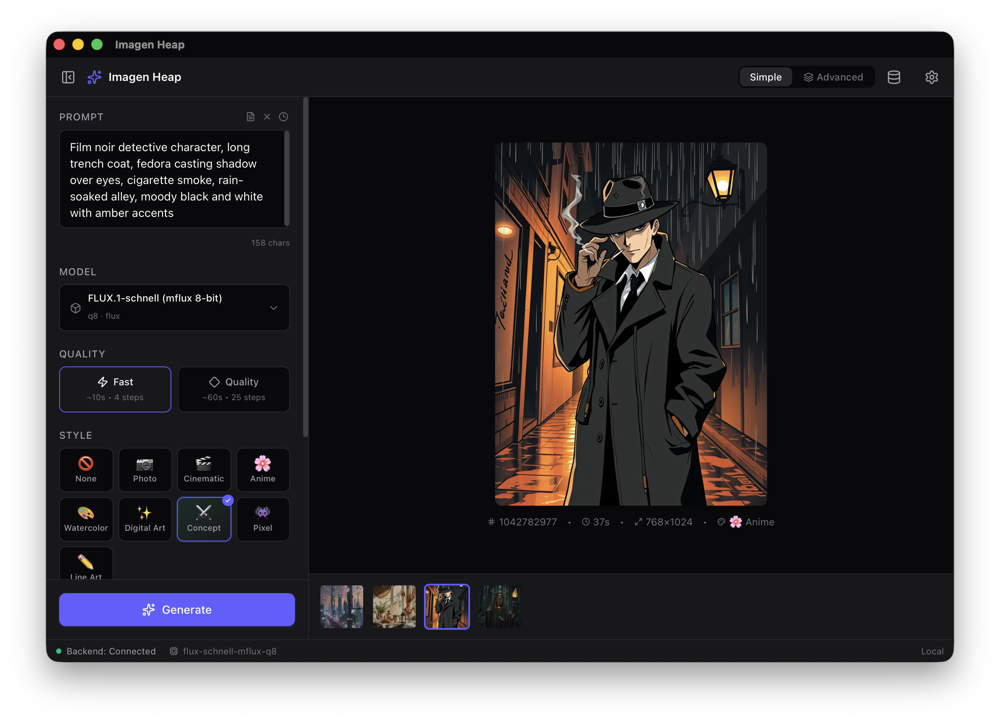
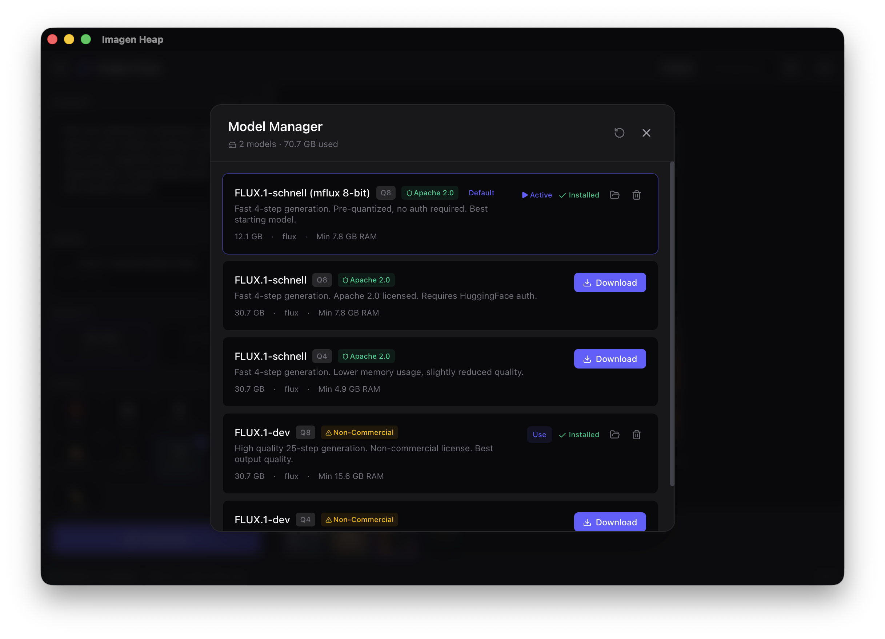

<div align="center">

# ✨ Imagen Heap

**A local-first AI image generation app for macOS (Apple Silicon)**

Built with Tauri · React · MLX — runs FLUX models entirely on-device.

No cloud. No API keys. Your creativity stays on your Mac.

</div>

---



## Features

### 🎨 Real AI Image Generation
- **FLUX.1 models** running locally via [MLX](https://github.com/ml-explore/mlx) and [mflux](https://github.com/filipstrand/mflux) — optimized for Apple Silicon
- **Fast mode** (~10s, 4 steps with FLUX.1-schnell) and **Quality mode** (~60s, 25 steps with FLUX.1-dev)
- Full control over **steps, CFG scale, seed, negative prompts**, and aspect ratios
- Seed locking for reproducible generations — randomize, copy, or lock seeds across runs
- Live generation progress with step counter, elapsed timer, and cancel support

### 🖼️ Style Presets
- **8 built-in styles**: Photo, Cinematic, Anime, Watercolor, Digital Art, Concept, Pixel Art, Line Art
- Each style applies a tuned prompt suffix, negative prompt, and recommended CFG
- Visual 4-column grid with gradient cards — select a style and generate instantly
- Style badge displayed in image metadata so you always know what was used

### 📝 Prompt Tools
- **32 prompt templates** across 7 categories (Portrait, Landscape, Concept Art, Product, Character Design, Abstract, Architecture)
- **Prompt history** — auto-saved after every generation, searchable, with timestamps and style info
- Auto-resizing textarea, clear button, and ⌘Enter keyboard shortcut to generate
- History persists across app restarts via localStorage

### 📦 Model Manager
- Download and manage FLUX models directly from HuggingFace
- Pre-quantized 8-bit and 4-bit variants (Q8/Q4) for different memory/quality tradeoffs
- Background downloads with real-time progress tracking in the status bar
- License badges, disk usage tracking, reveal in Finder, and delete with confirmation
- First-run setup wizard walks new users through their first model download



### 🖥️ Beautiful Dark UI
- Custom dark theme (zinc + indigo) designed for extended creative sessions
- Canvas with hover toolbar (Save, Copy, Delete) and right-click context menus
- Filmstrip history at the bottom — click to revisit, right-click to manage
- Image metadata display: seed, generation time, dimensions, style used
- Boundary-aware context menus that flip upward near window edges
- All settings persist between sessions — pick up exactly where you left off

## Tech Stack

| Layer | Technology |
|-------|-----------|
| Desktop shell | [Tauri v2](https://v2.tauri.app/) (Rust) |
| Frontend | React 19 + TypeScript + Vite |
| Styling | Tailwind CSS v4 + custom design tokens |
| State | Zustand (with localStorage persistence) |
| Icons | Lucide React |
| Inference | Python sidecar via JSON-RPC 2.0 over stdio |
| ML runtime | [MLX](https://github.com/ml-explore/mlx) + [mflux](https://github.com/filipstrand/mflux) |
| Models | FLUX.1-schnell, FLUX.1-dev (via HuggingFace) |

## Requirements

- **macOS** with Apple Silicon (M1/M2/M3/M4)
- **Python 3.12+** with mflux and dependencies
- **Node.js 20+** and **Rust 1.70+**
- At least **16 GB** unified memory (32+ GB recommended for FLUX.1-dev Q8)
- ~**13 GB** disk space for FLUX.1-schnell Q8, ~**54 GB** for FLUX.1-dev Q8

## Getting Started

### 1. Clone the repo

```bash
git clone https://github.com/svanvliet/imagen-heap.git
cd imagen-heap
```

### 2. Install dependencies

```bash
# Frontend
npm install

# Python inference sidecar
cd python
pip install -e ".[dev]"
cd ..
```

### 3. Run in development mode

```bash
./run.sh
```

This launches the Tauri dev server with hot reload. On first launch, the setup wizard will guide you through downloading your first model.

### 4. Build for distribution

```bash
./build.sh
```

Produces `Imagen Heap.app` and a `.dmg` installer in `src-tauri/target/release/bundle/`.

### 5. Publish a release

```bash
# Build + tag + push + create GitHub release with DMG attached
./build.sh --release v0.2.0

# With custom release notes
./build.sh --release v0.2.0 --notes "Added gallery view and favorites"
```

The release script validates the semver tag, bumps the version in `tauri.conf.json` and `package.json`, commits the change, creates an annotated git tag, pushes everything, and publishes a GitHub release with the DMG. If no `--notes` are provided, a changelog is auto-generated from the git log.

## Project Structure

```
imagen-heap/
├── src/                    # React frontend
│   ├── components/         # UI components (Canvas, Sidebar, Filmstrip, etc.)
│   ├── stores/             # Zustand state (generation, models, backend, UI)
│   ├── hooks/              # Custom hooks (useGeneration, useBackendStatus)
│   ├── lib/                # Constants, utilities, prompt templates
│   └── types/              # TypeScript type definitions
├── src-tauri/              # Rust backend (Tauri)
│   ├── src/lib.rs          # Sidecar management, IPC, Tauri commands
│   └── icons/              # App icons (all sizes)
├── python/                 # Python inference sidecar
│   └── src/imagen_heap/
│       ├── main.py         # Entry point
│       ├── rpc/            # JSON-RPC 2.0 server
│       ├── pipeline/       # Generation orchestrator
│       ├── providers/      # MLXProvider (mflux wrapper)
│       └── models/         # Model registry & manager
├── docs/                   # Requirements, research, plan, status
├── run.sh                  # Dev mode launcher
└── build.sh                # Distribution build script
```

## Architecture

```
┌──────────────┐     IPC      ┌──────────────┐    JSON-RPC    ┌──────────────┐
│   React UI   │◄────────────►│  Tauri/Rust   │◄─────────────►│   Python     │
│  (Renderer)  │  (commands)  │  (Main proc)  │  (stdio)      │  (Sidecar)   │
│              │              │              │               │              │
│ • Sidebar    │              │ • Sidecar    │               │ • MLXProvider│
│ • Canvas     │              │   manager    │               │ • Pipeline   │
│ • Filmstrip  │              │ • IPC bridge │               │ • ModelMgr   │
│ • StatusBar  │              │ • Commands   │               │ • RPC Server │
└──────────────┘              └──────────────┘               └──────────────┘
                                                                    │
                                                              ┌─────▼──────┐
                                                              │  MLX/mflux │
                                                              │  (Metal)   │
                                                              └────────────┘
```

The frontend communicates with Rust via Tauri IPC commands. Rust manages a Python sidecar process, forwarding requests as JSON-RPC 2.0 messages over stdio. The Python sidecar handles model management, inference via mflux/MLX, and sends progress notifications back through the same channel.

## Roadmap

| Milestone | Status | Description |
|-----------|--------|-------------|
| M1 Scaffold | ✅ | Project structure, design system, layout components |
| M2 Generation Pipeline | ✅ | End-to-end generation flow with progress streaming |
| M2b Real Inference | ✅ | MLX/mflux integration, HuggingFace downloads |
| M3 Model Management | ✅ | Model registry, downloads, First Run Wizard |
| M4 Style Presets | ✅ | 8 styles, prompt history, 32 templates |
| M5 Gallery & History | 🔲 | Persistent gallery, search, favorites |
| M6 Character System | 🔲 | IP-Adapter for consistent characters |
| M7 Community Hub | 🔲 | Browse & download models, presets, templates |
| M8 Cloud Inference | 🔲 | Microsoft Foundry routing for larger models |
| M9 Polish | 🔲 | First-run experience, accessibility, performance |

## License

This project is for personal/internal use. See individual model licenses for FLUX.1 terms (Apache 2.0 for schnell, non-commercial for dev).
